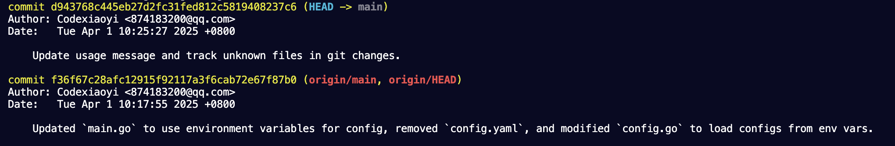

## Auto commit by ai with the all changes format.



## Configuration

The application supports multiple AI models, including OpenAI, Ollama, and Anthropic. The configuration is managed using environment variables with default values.

### Environment Variables

| Variable Name          | Default Value                     | Description                          |
|------------------------|---------------------------------|--------------------------------------|
| `AI_TYPE`             | `ollama`                        | Specifies the AI model type to use  |
| `OPENAI_API_KEY`      | `""`                            | OpenAI API key                      |
| `OPENAI_MODEL`        | `gpt-3.5-turbo`                 | OpenAI model to be used             |
| `OLLAMA_BASE_URL`     | `http://localhost:11434`        | Base URL for Ollama                 |
| `OLLAMA_MODEL`        | `qwen2.5:7b`                    | Ollama model to be used             |
| `ANTHROPIC_API_KEY`   | `""`                            | Anthropic API key                   |
| `ANTHROPIC_MODEL`     | `claude-3-opus-20240229`        | Anthropic model to be used          |

### Usage

Ensure that the required environment variables are set before running the application. You can override the defaults by setting them in your environment.

Example:
```sh
export OPENAI_API_KEY="your_api_key_here"
export AI_TYPE="openai"
```

Git-related code is referenced from https://github.com/jatinsandilya/mcp-server-auto-commit. Thanks to jatinsandilya!